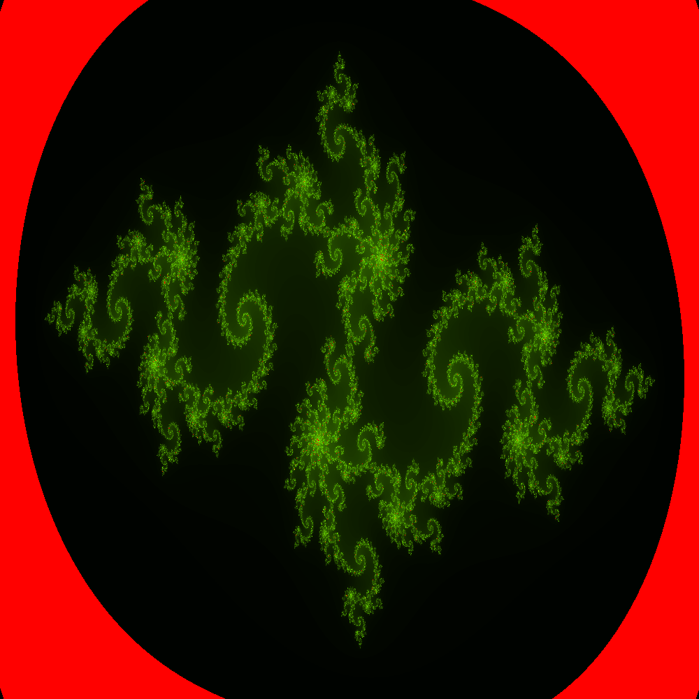
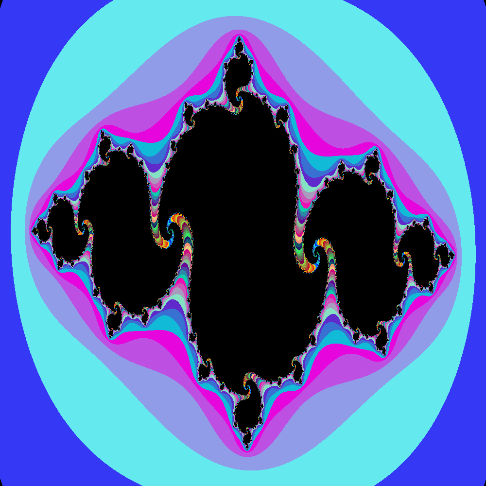
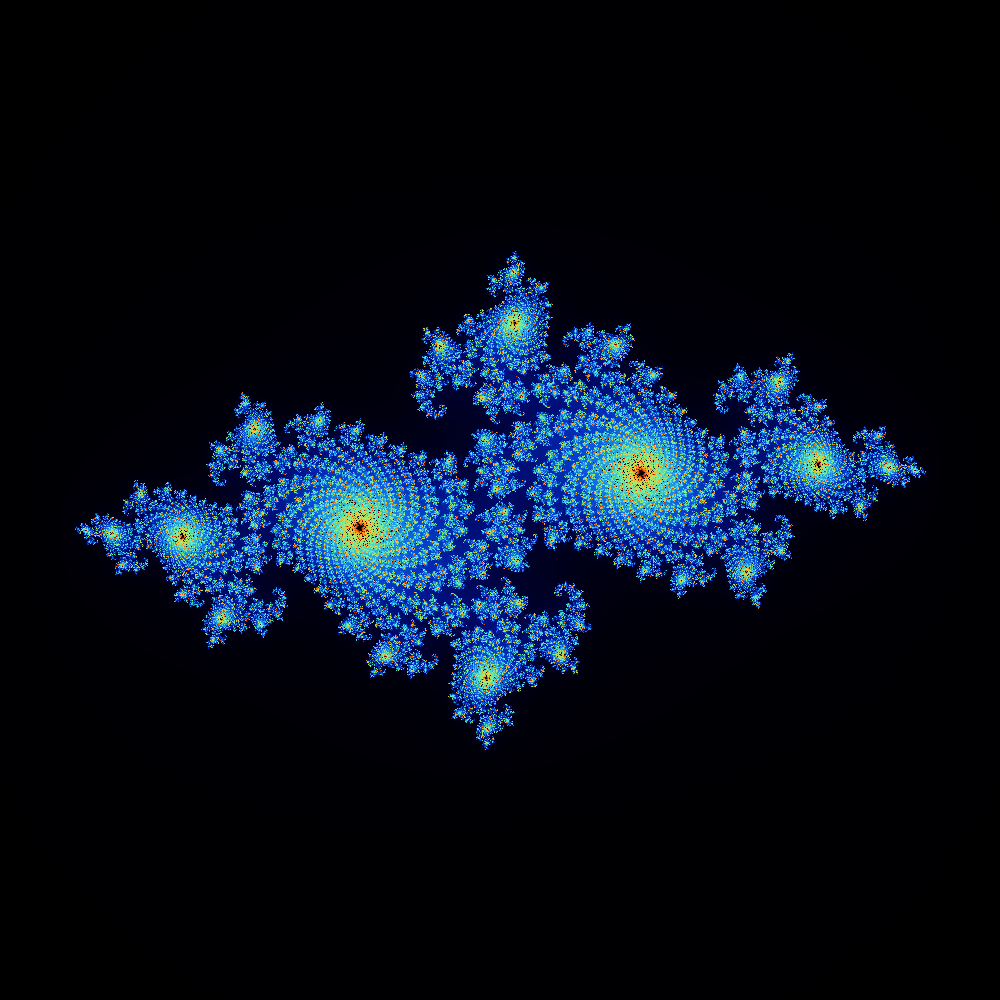

# Julia Set Generation

This project includes implementations for generating the Mandelbrot set and Julia sets, two famous fractals in mathematics. The provided files demonstrate how to calculate these sets and visualize them using the PNG image format.

## `parallel_combined_mandelbrot.c`

### Overview

- This file contains the main implementation of the parallel Mandelbrot set generation using MPI.
- It includes functions for calculating Mandelbrot set points, mapping iterations to colors, and writing the results to a PNG image file.
- The program distributes the computation of Mandelbrot set points among multiple MPI processes to leverage parallelism.

### Compilation and Execution

- To compile the code, you need an MPI implementation such as Open MPI
- Compile the code using a suitable MPI compiler wrapper. For example:
  ```bash
  mpicc parallel_combined_mandelbrot.c -o parallel_combined_mandelbrot -lm -lpng
  ```

### Parameters

- `WIDTH` and `HEIGHT`: Define the dimensions of the image (in pixels) representing the Mandelbrot set.
- `MAX_ITERATION`: Maximum number of iterations used to determine if a point is in the Mandelbrot set.
- `COLOR_CHOICE`: Choose a color scheme for rendering the Mandelbrot set.

### Output

- The program generates a PNG image file named `mandelbrot_<WIDTH>x<HEIGHT>_color-<COLOR_CHOICE>_iterations-<MAX_ITERATION>.png`, which contains the rendered Mandelbrot set using the specified parameters.

### Benchmarking

| Width | Height | Total processes | Total computation time (Seconds) | Computation time per process (Seconds) | Resolution of MPI_Wtime (Seconds) |
| ----- | ------ | --------------- | -------------------------------- | -------------------------------------- | --------------------------------- |
| 100   | 100    | 8               | 0.4242768                        | 0.05303459                             | 0.000000001                       |
| 100   | 100    | 16              | 0.01917587                       | 0.001198492                            | 0.000000001                       |
| 100   | 100    | 32              | 0.01530967                       | 0.000478427                            | 0.000000001                       |
| 100   | 100    | 64              | 0.05119586                       | 0.000799935                            | 0.000000001                       |
| 1000  | 1000   | 8               | 0.7063557                        | 0.08829446                             | 0.000000001                       |
| 1000  | 1000   | 16              | 0.5407459                        | 0.03379662                             | 0.000000001                       |
| 1000  | 1000   | 32              | 0.2821067                        | 0.008815833                            | 0.000000001                       |
| 1000  | 1000   | 64              | 0.197832                         | 0.003091126                            | 0.000000001                       |
| 10000 | 10000  | 8               | 61.3226                          | 7.665325                               | 0.000000001                       |
| 10000 | 10000  | 16              | 40.92115                         | 2.557572                               | 0.000000001                       |
| 10000 | 10000  | 32              | 24.85912                         | 0.7768476                              | 0.000000001                       |
| 10000 | 10000  | 64              | 15.63836                         | 0.2443494                              | 0.000000001                       |

## `parallel_combined_julia_sets.c`

### Overview

- This file contains the main implementation of the parallel Julia set generation using MPI.
- It includes functions for calculating Julia set points, mapping iterations to colors, and writing the results to a PNG image file.
- The program distributes the computation of Julia set points among multiple MPI processes to leverage parallelism.

### Compilation and Execution

- To compile the code, you need an MPI implementation such as Open MPI or MPICH installed on your system.
- Compile the code using a suitable MPI compiler wrapper. For example:
  ```bash
  parallel_combined_julia_sets.c -o parallel_combined_julia_sets -lm -lpng
  ```

### Parameters

- `WIDTH` and `HEIGHT`: Define the dimensions of the image (in pixels) representing the Julia set.
- `MAX_ITERATION`: Maximum number of iterations used to determine if a point is in the Julia set.
- `REAL_NUMBER` and `IMAGINARY_NUMBER`: Parameters defining the constant complex number used in the Julia set calculation.
- `COLOR_CHOICE`: Choose a color scheme for rendering the Julia set.

### Output

- The program generates a PNG image file named `julia-set_<WIDTH>x<HEIGHT>_color-<COLOR_CHOICE>_iterations-<MAX_ITERATION>_real-<REAL_NUMBER>_imaginary-<IMAGINARY_NUMBER>.png`, which contains the rendered Julia set using the specified parameters.

### Benchmarking

| Width | Height | Total processes | Total computation time (Seconds) | Computation time per process (Seconds) | Resolution of MPI_Wtime (Seconds) | Real Number | Imaginary Number |
| ----- | ------ | --------------- | -------------------------------- | -------------------------------------- | --------------------------------- | ----------- | ---------------- |
| 100   | 100    | 8               | 0.009894097                      | 0.001236762                            | 0.000000001                       | \-0.8       | \-0.089          |
| 100   | 100    | 16              | 0.01151926                       | 0.000719954                            | 0.000000001                       | \-0.8       | \-0.089          |
| 100   | 100    | 32              | 0.009169879                      | 0.000286559                            | 0.000000001                       | \-0.8       | \-0.089          |
| 100   | 100    | 64              | 0.08000312                       | 0.001250049                            | 0.000000001                       | \-0.8       | \-0.089          |
| 1000  | 1000   | 8               | 0.7972544                        | 0.0996568                              | 0.000000001                       | \-0.8       | \-0.089          |
| 1000  | 1000   | 16              | 0.5368367                        | 0.0335523                              | 0.000000001                       | \-0.8       | \-0.089          |
| 1000  | 1000   | 32              | 0.384181                         | 0.01200565                             | 0.000000001                       | \-0.8       | \-0.089          |
| 1000  | 1000   | 64              | 0.3744039                        | 0.005850061                            | 0.000000001                       | \-0.8       | \-0.089          |
| 10000 | 10000  | 8               | 65.8631                          | 8.232887                               | 0.000000001                       | \-0.8       | \-0.089          |
| 10000 | 10000  | 16              | 47.71285                         | 2.982053                               | 0.000000001                       | \-0.8       | \-0.089          |
| 10000 | 10000  | 32              | 29.1897                          | 0.9121781                              | 0.000000001                       | \-0.8       | \-0.089          |
| 10000 | 10000  | 64              | 17.74668                         | 0.2772919                              | 0.000000001                       | \-0.8       | \-0.089          |


## Challenges Faced

Throughout the development of the Julia and Mandelbrot set generation program, several challenges were encountered and overcome. Below are some of the notable difficulties we faced:

- **Positioning and Alignment**:  Another challenge arose from ensuring that the Mandelbrot and Julia sets were correctly positioned within the image frame. Incorrect positioning could result in portions of the sets being cropped out or displayed at the wrong location, leading to distorted or incomplete images. To address this, we carefully mapped the pixel coordinates of the sets to the corresponding points in the complex plane, ensuring accurate alignment and placement within the image frame. Additionally, we adjusted the scaling and translation parameters to center the sets within the image and maintain their relative proportions.

- **Memory Management**: One significant issue arose when attempting to store large arrays representing the Mandelbrot and Julia sets in memory. As the size of the dataset increased, memory consumption became a limiting factor, leading to out-of-memory errors and segmentation faults. To mitigate this issue, we adopted a strategy of calculating the sets in smaller, manageable chunks. Instead of trying to store the entire dataset in memory simultaneously, we processed and wrote sections of the sets to file incrementally, thereby reducing the memory footprint and avoiding memory exhaustion.

Certainly, let's incorporate that into the challenges section:

- **Finding Suitable Color Maps**: Selecting an appropriate color map for visualizing the Mandelbrot and Julia sets posed a significant challenge. Aesthetic considerations, such as color harmony, contrast, and perceptual uniformity, were crucial in ensuring that the rendered images were visually appealing and easy to interpret. We experimented with different color schemes, gradients, and palettes to find a balance between aesthetics and functional readability. This iterative process involved evaluating the impact of color choices on the clarity and interoperability of the sets, as well as their overall visual impact.

## Example Images

<!-- 







 -->

<div style="display: flex; flex-wrap: wrap; gap: 20px;">
    <div style="flex: 0 0 calc(33.33% - 20px);">
        
    </div>
    <div style="flex: 0 0 calc(33.33% - 20px);">
        
    </div>
    <div style="flex: 0 0 calc(33.33% - 20px);">
        
    </div>
</div>

<div style="display: flex; flex-wrap: wrap; gap: 20px;">
    <div style="flex: 0 0 calc(33.33% - 20px);">
        
    </div>
    <div style="flex: 0 0 calc(33.33% - 20px);">
        
    </div>
    <div style="flex: 0 0 calc(33.33% - 20px);">
        
    </div>
</div>