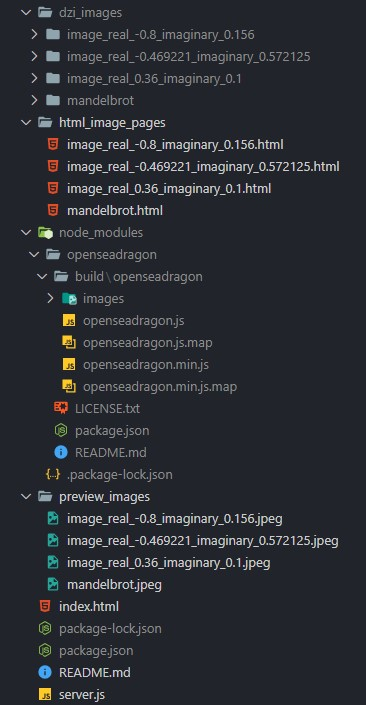

## Setting Up the HTML Viewer with Node.js Server and OpenSeadragon

### Install Node.js

Download and install Node.js from [the official website](https://nodejs.org/en).

### Install OpenSeadragon Package

```bash
npm install openseadragon
```

###  Downloading zip Folder Full of Deep Zoom Images and Folder Structure

1. **Download and Extract the Zip Folder**: Go [here](https://drive.google.com/file/d/1FKME-I9dDG1xW4eVcQjUGCzXnOnn8rtl/view?usp=sharing) to download the zip folder containing the Deep Zoom Images. Use the tool 7zip to extract the contents.

2. **Folder Structure Example**: Here is an example of how your folder structure should look after extracting the zip folder:



### Run npm Server

Start your Node.js server to serve the HTML file along with the OpenSeadragon library and DZI files.

## BONUS: How to make Deep Zoom Images and Include them in your HTML

### Install VIPS on Linux

```bash
sudo apt install libvips-tools
```

### Generate Deep Zoom Images (DZI) with VIPS

```bash
vips dzsave <input-file-destination> <output-name>
```

NOTE: The output will be in the directory you are currently in. 

### To inInclude OpenSeadragon in Your HTML

All you have to do is include the following snip-it in your html with the correct path to the node modules and dzi file! :)

```html
<div id="openseadragon1" style=" width: 900px; height: 900px;"></div>
<script src="node_modules/openseadragon/build/openseadragon/openseadragon.min.js"></script>
<script type="text/javascript">
    var viewer = OpenSeadragon({
        id: "openseadragon1",
        prefixUrl: "node_modules/openseadragon/build/openseadragon/images/",
        tileSources: "mydz.dzi"
    });
</script>
```